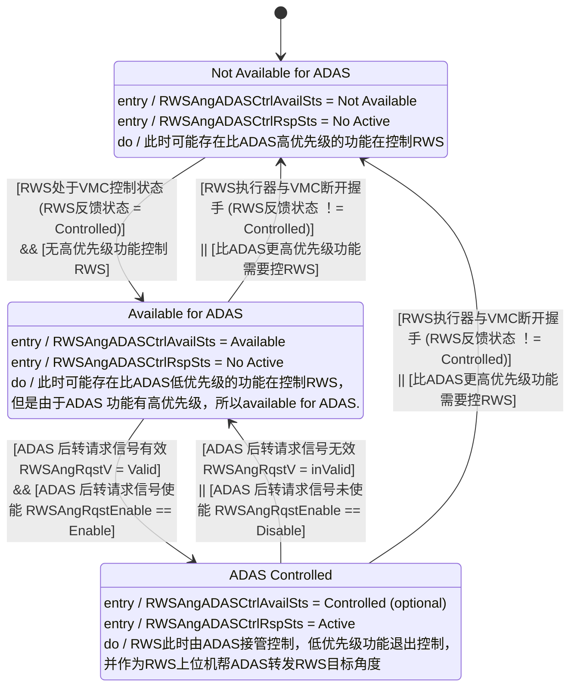

```mermaid
stateDiagram-v2
%%ADAS交互
[*] --> Not_Available
%%状态定义
Not_Available: Not Available for ADAS
Not_Available: entry / RWSAngADASCtrlAvailSts = Not Available 
Not_Available: entry / RWSAngADASCtrlRspSts = No Active
Not_Available: do / 此时可能存在比ADAS高优先级的功能在控制RWS
 
Available: Available for ADAS
Available: entry / RWSAngADASCtrlAvailSts = Available
Available: entry / RWSAngADASCtrlRspSts = No Active
Available: do / 此时可能存在比ADAS低优先级的功能在控制RWS，\n但是由于ADAS 功能有高优先级，所以available for ADAS.
 
Controlled:ADAS Controlled
Controlled: entry / RWSAngADASCtrlAvailSts = Controlled (optional)
Controlled: entry / RWSAngADASCtrlRspSts = Active
Controlled: do / RWS此时由ADAS接管控制，低优先级功能退出控制，\n并作为RWS上位机帮ADAS转发RWS目标角度
 
 
%%状态转移
Not_Available --> Available : [RWS处于VMC控制状态 (RWS反馈状态 = Controlled)] <br> && [无高优先级功能控制RWS]
 
Available --> Controlled : [ADAS 后转请求信号有效 RWSAngRqstV = Valid] <br> && [ADAS 后转请求信号使能 RWSAngRqstEnable == Enable]
Available --> Not_Available : [RWS执行器与VMC断开握手 (RWS反馈状态 ！=  Controlled)] <br>|| [比ADAS更高优先级功能需要控RWS]
 
Controlled --> Available : [ADAS 后转请求信号无效 RWSAngRqstV = inValid] <br>|| [ADAS 后转请求信号未使能 RWSAngRqstEnable == Disable]
Controlled --> Not_Available : [RWS执行器与VMC断开握手 (RWS反馈状态 ！=  Controlled)] <br>|| [比ADAS更高优先级功能需要控RWS]

```
